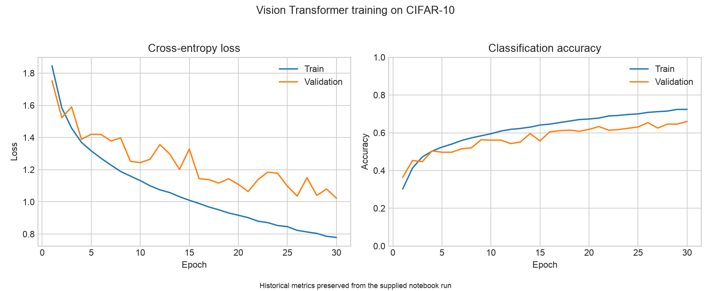

# Vision Transformer from Scratch on CIFAR-10

[](https://github.com/volkthienpreecha/cifar10-vision-transformer/actions/workflows/ci.yml)

A readable PyTorch implementation of a Vision Transformer without relying on a prebuilt transformer layer. The project implements patchification, learned patch and position embeddings, vectorized multi-head self-attention, pre-normalized encoder blocks, and class-token classification.



## Highlights

- Q/K/V projections and head splitting implemented with native tensor operations.
- Learned class token and positional embeddings.
- Pre-layer-normalized attention and MLP residual blocks.
- Tiny, small, and base configuration factories.
- Reproducible CIFAR-10 split, augmentation, AdamW training, and best-checkpoint saving.
- Fast CPU tests for attention shapes, patch geometry, dtype/device safety, and training utilities.

## Architecture flow

```text
32×32 RGB image
  → 64 non-overlapping 4×4 patches
  → linear patch embeddings
  → prepend learned class token
  → add learned position embeddings
  → repeated transformer encoder blocks
       LayerNorm → multi-head attention → residual
       LayerNorm → GELU MLP → residual
  → normalized class token
  → 10-class logits
```

The attention path is fully vectorized across batches and heads. Constructor validation catches incompatible embedding/head dimensions and invalid patch geometry before training begins.

## Model configurations

| Factory | Layers | Heads | Embedding | MLP hidden |
|---|---:|---:|---:|---:|
| `vit_tiny()` | 12 | 3 | 192 | 768 |
| `vit_small()` | 12 | 6 | 384 | 1,536 |
| `vit_base()` | 12 | 12 | 768 | 3,072 |

## Recorded result

The supplied 30-epoch run reached **66.0% validation accuracy** with a validation loss of **1.023**. These are historical metrics from one executed notebook and one train/validation split—not a newly reproduced held-out test score.

The complete history is available in [`artifacts/training_history.csv`](artifacts/training_history.csv).

## Setup

Python 3.10 or newer is required.

```bash
python -m venv .venv
source .venv/bin/activate
python -m pip install -e ".[dev]"
```

## Train

The first run downloads CIFAR-10 through `torchvision`.

```bash
cifar10-vit-train \
  --model tiny \
  --device auto \
  --data-dir data/cifar10 \
  --epochs 30 \
  --batch-size 32 \
  --output-dir runs/vit-tiny
```

The default learning rate follows the notebook's linear batch-size scaling: `5e-4 × batch_size / 256`. Run `cifar10-vit-train --help` for all options.

## Use the model

```python
import torch
from cifar10_vit.model import vit_tiny

model = vit_tiny(num_classes=10)
logits = model(torch.randn(8, 3, 32, 32))
print(logits.shape)  # torch.Size([8, 10])
```

## Walkthrough

[`notebooks/cifar10_vit_walkthrough.ipynb`](notebooks/cifar10_vit_walkthrough.ipynb) explains the implementation from patchification through evaluation and loads the preserved metrics. Expensive training is disabled by default.

## Repository structure

```text
src/cifar10_vit/         transformer, data pipeline, engine, and CLI
tests/                   CPU-only model and training tests
notebooks/               curated project walkthrough
artifacts/               historical metrics and learning curves
.github/workflows/ci.yml lint and test automation
```

## Test

```bash
python -m pytest -q
python -m ruff check src tests
```

Tests use synthetic tensors and do not download CIFAR-10.

## Limitations

- Training starts from random initialization on a relatively small dataset.
- Historical metrics represent one split and seed.
- No pretrained weights or checkpoints are included.
- Full training is compute-intensive and is not run in CI.
- The implementation favors clarity over optimized attention kernels.

## References

- A. Dosovitskiy et al., [An Image is Worth 16×16 Words: Transformers for Image Recognition at Scale](https://arxiv.org/abs/2010.11929), 2020.
- A. Krizhevsky, [Learning Multiple Layers of Features from Tiny Images](https://www.cs.toronto.edu/~kriz/cifar.html), 2009.
- [PyTorch](https://pytorch.org/) and [torchvision](https://pytorch.org/vision/stable/).

## Provenance

The transformer implementation and recorded experiment began as academic computer-vision work and were subsequently cleaned, tested, and packaged for reproducible public presentation. Classroom prompts, grading utilities, and submission code are intentionally excluded.
